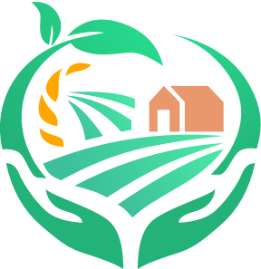
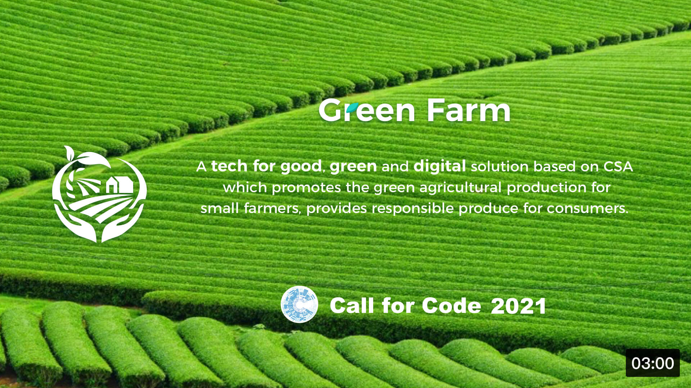
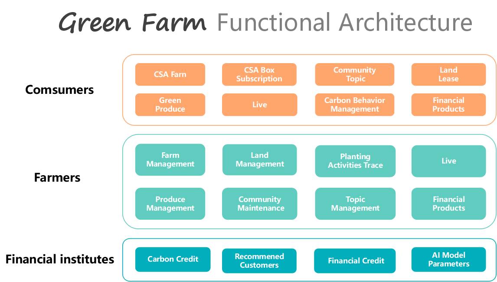
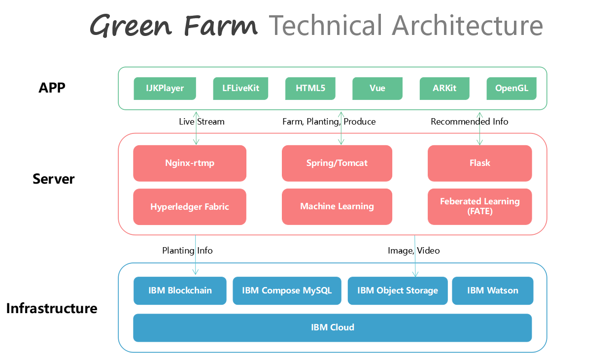
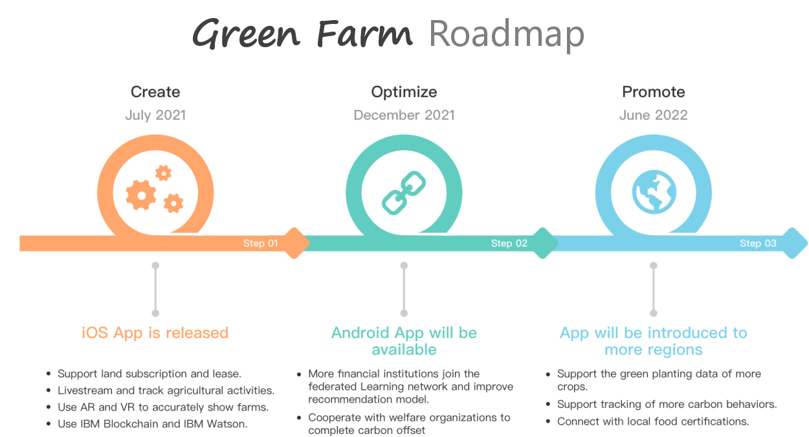

# Green Farm

*IBM : Call for Code 2021*

**Green Farm is a tech-for-good, green and digital solution based on CSA which promotes the green agricultural production for small farmers, provides responsible produce for consumers. It is available for download on Apple Store.**

> CSA: Community Supported Agriculture. CSA regularly provides consumers with fresh products from local farms. It is a sustainable alternative to industrial agriculture.

## Contents

  - [Short description](#short-description)
    - [What's the problem?](#whats-the-problem)
    - [How can technology help?](#how-can-technology-help)
    - [The idea](#the-idea)
  - [Demo video](#demo-video)
  - [The architecture](#the-architecture)
  - [Long description](#long-description)
  - [Project roadmap](#project-roadmap)
  - [Getting started](#getting-started)
  - [Live demo](#live-demo)
  - [Built with](#built-with)
  - [Contributing](#contributing)
  - [License](#license)
  

## Short description

### What's the problem?

Responsible and sustainable agriculture is our major focus.

The agriculture accounts for about one-third of global greenhouse gas emissions. Sustainable farming plays an important role in helping reducing carbon emissions and combat climate change, however, it still makes up a small share of farming practice. 

For small farmers, their planting methods are usually neither low-carbon nor sustainable. It is difficult for them to try alternative methods because of easy susceptible to weather change, financial risks and unstable customer demands. For consumers, during COVID-19 pandemic, they have participated in CSA farms to get clean, fresh food delivered to doors. However, a large number of new local CSA farms emerged lately, they concern about the quality standards of these produce and whether the production process is green.  

### How can technology help?

 * Connect producers and consumers in real-time (Using live streaming technology).
 * Make customers feel in the middle of farms (Using AR（Augmented Reality）and VR(Virtual Realtiy) to show farms accurately and objectively).
 * Recommend suitable farms, produce and financial products to consumers (using IBM Waston to perform efficient matching and recommendations)
 * Ensure the credibility and traceability of the sustainable planting process (Using IBM Blockchain).
 * Enable consumers from different countries at multiple areas to efficiently find CSA farms nearby and get fresh produce (Using mapping technology).
 * Provide small farmers and consumers with targeted financial support (setting up a federated learning network with different financial institutions involved).

Green Farm's technology is built and deployed on IBM Cloud and our program is written in: Java, Python, Html5, Javascript. In addition, we used IBM Blockchain, IBM Cloud object storage, IBM Federated Learning, IBM Watson Machine Learning, Live Streaming ,AR,VR and so on to make our app more professional, thus, connect small farmers who practice sustainable planting with consumers who demand for green, credible food.

### The idea

The SDGs(Sustainable Development Goals) adopted by the United Nations include "Clean water and sanitation, Zero hunger, Responsible production and green consumption". Based on the SDGs, Call for Code 2021 Global Challenge calls for taking immediate actions to combat climate change. In a study published by FAO, it points out that the world's food systems are responsible for more then one-third of global greenhouse gas emissions. To motivate sustainable, traceable agriculture,  we build Green Farm to help reduce carbon footprint of food production and enable customers to find CSA farms nearby, get fresh, clean,green food and support the local agriculture. 

## Demo video

## The architecture

The functional architecture of green farm includes three layers: consumers, farmers and financial institutions.
1. Consumers: They can find CSA farms, subscribe to CSA Boxes, join communities, rent land, watch live, buy produce, etc.
2. Farmers: They can manage their farms, land and produce, carry out green planting, launch live, maintain communities and topics, etc.
3. Financial institutions: They can obtain carbon credit data and financial credit data, and recommend financial products to customers, etc.

The technical architecture of green farm includes three layers: app, server and infrastructure.
1. The app layer includes ijkplayer, HTML5, Vue, arkit and other technologies.
2. The server layer includes Nginx, Hyperledger Fabric, Machine Learning, Federated Learning and other technologies.
3. The infrastructure layer includes IBM Blockchain, IBM Object Storage, IBM Waston and other technologies.

## Long description

[More detail is available here](./docs/Long%20Description_Green%20Farm.md)

## Project roadmap

1. In July 2021, Green Farm iOS version has been released to help small farms better operate with CSA philosophy, support land subscription and lease, keep photos and videos of planting activities, and livestream agricultural production activities.  It supports online sales of produce and user reviews, post creation and share in the farm community; It also supports tracking planting activities from IBM blockchain and converting them into carbon credits. Green Farm recommends farms, produce and green financial products to users through machine learning and federated learning.

2. In December 2021, Android version will be available for download. More financial institutions will join the federated Learning network, Green Farm will integrate real-time weather data and improve machine learning and federal learning models, to help small farmers better practice low-carbon and green planting. The updated version also cooperates with public welfare organizations to complete green planting donations and carbon offset, thus encouraging CSA users to cultivate a low-carbon lifestyle.

3. In June 2022, Green Farm will be introduced to more farms in more regions, supporting the green planting data of more crops and the tracking of more carbon behaviors, to further improve the green planting guidance function. Moreover, it will connect with the local food safety certification, and help more farmers and consumers join CSA more conveniently and enjoy green, fresh and credible produce.

## Getting started
You can find a deployed App on Apple App store. Click and [download](https://apps.apple.com/cn/app/id1576617731). 

The GreenFarm project consists of four modules: `greenfarm-server`, `greenfarm-frontend`, `greenfamr-ios` and `greenfarm-ai`. Each module is built and packaged as follows:
- [greenfarm-server](./greenfarm-server/README.md)
- [greenfarm-frontend](./greenfarm-frontend/README.md)
- [greenfarm-ios](./greenfarm-ios/README.md)
- [greenfarm-ai](./greenfarm-ai/README.md)

## Live demo
In the linked video below, we show all the functions of the APP, including farm addition, land subscription and lease, planting activity management, produce display, purchase, community Posting and reply, etc.
- [Demo1](https://youtu.be/yHzeREG7658) 
- [Demo2](https://youtu.be/GOU8UZwALRA)

## Built with

- [IBM Blockchain](https://cloud.ibm.com/catalog?search=Blockchain#search_results) - The backend application used
- [IBM Waston](https://www.ibm.com/watson) - The recommendation logic
- [IBM Cloud object storage](https://cloud.ibm.com/catalog?search=object%20storage#search_results) - The backend application used
- [AR Ruler](https://github.com/TBXark/Ruler) Measure area using ARKit.
- [VR Photo](https://github.com/robbykraft/Panorama) OpenGL is used for image stitching and 2D - 3D conversing.
- [Live Audience](https://github.com/bilibili/ijkplayer) Video player based on FFmpeg, with MediaCodec support.
- [Live Anchor](https://github.com/LaiFengiOS/LFLiveKit) Live streaming uses LFLiveKit.
- [Maven](https://maven.apache.org/) - Java Dependency management
- [NPM](https://www.npmjs.com)  NodeJS package management
- [Xcode](https://developer.apple.com/xcode)  iOS app development IDE

## Contributing

Please read [CONTRIBUTING.md](./CONTRIBUTING.md) for details on our code of conduct, and the process for submitting pull requests to us.

## License

This project is licensed under the Apache 2 License - see the [LICENSE](./LICENSE) file for details.
